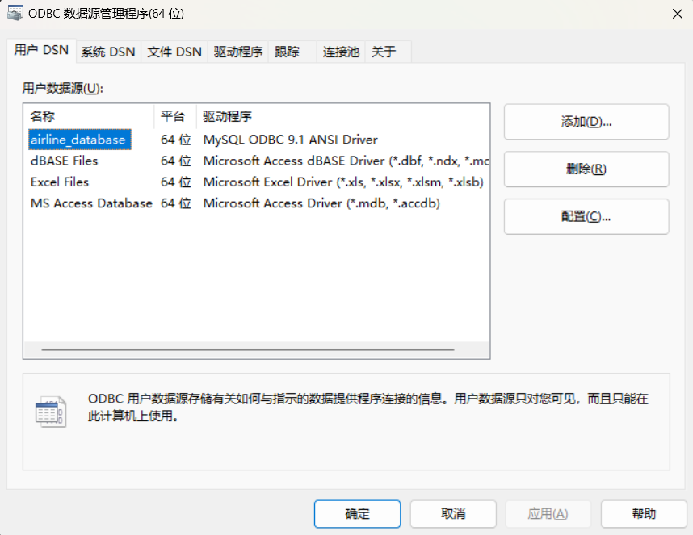

# 航空订票系统

这是一个基于Qt和MySQL开发的航空订票系统。系统提供了用户友好的图形界面,支持航班查询、订票、退票等功能。

## 主要功能

- 用户注册与登录
- 航班信息查询 
- 机票预订
- 订单管理
- 用户信息管理
- 密码修改

## 技术栈

- 前端界面: Qt
- 数据库: MySQL 
- 数据库连接: ODBC
- 开发语言: C++

## 环境配置

### 1. 配置ODBC数据源

1. 打开ODBC数据源管理器
2. 添加新的数据源,命名为"airline_database"

3. 点击"添加"按钮,创建名为"airline_database"的新数据库

### 2. 初始化数据库

运行database_build.sql脚本以创建所需的数据库和表

## 使用说明

1. 确保已正确配置ODBC数据源和数据库
2. 运行主程序登录系统
3. 可以进行航班查询、订票等操作

## 系统架构

- UI界面采用Qt框架
- 使用MVC设计模式
- 通过ODBC实现数据库连接
- 模块化设计,便于维护和扩展